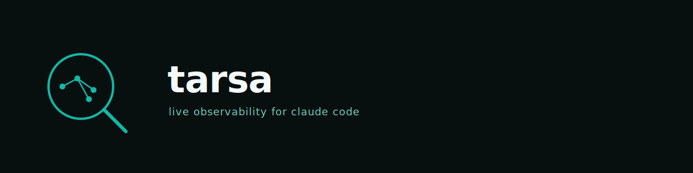

# Tarsa

Live observability for Claude Code agent sessions. Topology, timeline, tool I/O, transcripts, cost — visible while the session runs.

<p align="center">
  
</p>

## Quick Start

**Recommended — Bun (zero native compile):**

```sh
bunx tarsa
```

Bun uses its built-in `bun:sqlite` and needs no native build step, so this is
the most robust install path across platforms and Node versions.

**Node:**

```sh
npx tarsa
```

On Node, `better-sqlite3` (and the embedded terminal's `node-pty`) compile from
source unless a prebuilt binary matches your Node version — keep Node current if
the install fails to build.

**One-line install (clones, builds frontend, installs global):**

```sh
curl -fsSL https://raw.githubusercontent.com/elcronos/tarsa/main/install.sh | sh
```

Source lives at `~/.tarsa-src`. Override with `TARSA_HOME=/custom/path`.

Requires Bun 1.x, or Node 20+.

First run installs hooks into `~/.claude/settings.json` and opens `http://localhost:8100`. Start a Claude Code session in any project; agents appear in real time.

## Features

- **Topology graph** — DAG of agents and subagents with depth-grid layout. Edges color-coded by relationship (root, nested, team).
- **Timeline** — Gantt with parallel-bar grouping and depth indentation.
- **Replay** — chronological event stream with expandable tool input/output, full-text search, status filters.
- **Insights** — bottleneck detection, cost breakdown (transcript-measured when available, char/tool-count fallback otherwise), error-recovery analysis, stuck-agent alerts, agent-type baselines + z-scores.
- **Detail panel** — per-agent tabs: trace, transcript thread, files touched, prompt, result. Cost provenance badge (measured vs estimated). Optional LLM-generated 1-sentence prompt summary via local `claude --model haiku`.
- **Time-travel scrubber** — drag through session history; state derived via pure reducer.
- **Session diff** — side-by-side compare two sessions; agent matching by `(subagent_type, depth, sibling_order)`.
- **Global view** — default view; all sessions at once, mini-DAG per session, filter stale/live.
- **Embedded terminal** — optional per-agent Terminal tab backed by vendored cc-web (MIT). Resumes the agent's actual Claude Code session via `claude --resume <id>` when a transcript exists; otherwise spawns a fresh claude in the same cwd. Disable with `TARSA_TERMINAL=0`.
- **Subagent dedup** — Agent-tool pre-create stub migrates onto the real `agent_id` when SubagentStart fires; subagent re-parenting attaches subagent processes to their spawning session.
- **Team detection** — `worker-*` and `team-*` subagent types render with team badges and orange edges.

## CLI

| Flag | Description |
|---|---|
| `--port <n>` | Listen on port `n` (default `8100`) |
| `--host <addr>` | Bind to address (default `127.0.0.1`; requires `--allow-remote` for non-loopback) |
| `--allow-remote` | Enable remote access: binds to specified host, generates auth token, requires `Authorization: Bearer <token>` on all POST routes |
| `--no-browser` | Skip auto-opening browser |
| `--install-hooks` | Install hooks into `~/.claude/settings.json`, then exit |
| `--uninstall` | Remove Tarsa hooks, then exit |
| `--append-event <name>` | Read JSON from stdin, write to event log (used by hook commands) |

> **Remote mode:** When `--allow-remote` is set, a 32-byte hex token is written to `~/.tarsa/token` (mode `0600`) and the auto-opened browser URL includes `?token=<value>`. All POST endpoints require `Authorization: Bearer <token>`. In default localhost mode no token is generated and no auth middleware is registered.

## Architecture

```
Claude Code hooks
  → tarsa --append-event → ~/.tarsa/events.jsonl (mode 0600)
        ↓ tail
  src/tailer.ts        adaptive-poll JSONL tailer
  src/processor.ts     append-only event log + structural-sharing reducer
  src/shared/replay-core.ts   pure reducer, shared with frontend
  src/db.ts            SQLite persistence (better-sqlite3 / bun:sqlite)
  src/transcript.ts    Claude Code transcript reader (tokens, prompt, thread)
  src/insights.ts      bottleneck / cost / stuck / recovery / baselines
  src/search.ts        in-memory inverted index, seeded from DB on start
  src/server.ts        Hono REST + SSE on :8100, dual-runtime adapter
        ↓ SSE
  frontend/            React + Vite + Tailwind, single-page dashboard
```

State locations:
- Event log: `~/.tarsa/events.jsonl` (mode 0600; legacy `/tmp/tarsa.jsonl` migrated on first run)
- DB: `~/.tarsa/history.db` (sessions, agents, tool_calls, events, baselines)
- Remote auth token (only with `--allow-remote`): `~/.tarsa/token` (mode 0600)
- Hooks: `~/.claude/settings.json` (entries marked with `tarsa --append-event`)

## Why Tarsa

**Q: I can already see what Claude Code is doing in my terminal. Why do I need this?**

The terminal shows one agent's output. Tarsa shows the full picture: which subagents ran in parallel, which tools were called and how long they took, where cost accumulated, and whether any agent got stuck. For multi-agent sessions the terminal is unreadable; Tarsa is the only way to understand what actually happened.

**Q: How is this different from ccusage or claude-trace?**

`ccusage` aggregates token costs from transcript files after the fact. `claude-trace` captures HTTP traffic and shows raw API calls. Tarsa is real-time, hook-based, and focused on the agent graph rather than raw API calls or billing aggregates. It shows the DAG, the timeline, the tool I/O, and the cost — live, while the session runs.

**Q: Does it work with other AI coding tools?**

No. Tarsa is Claude Code only. The hook system it relies on is specific to Claude Code. Supporting other tools is out of scope.

**Q: Does it slow down my Claude Code sessions?**

No. Hooks write a JSON line to `~/.tarsa/events.jsonl` and exit. The append is non-blocking and adds no latency to the agent session itself.

**Q: Is my data sent anywhere?**

No. Everything runs locally. The server binds `127.0.0.1` by default. No telemetry, no cloud sync, no external requests (except the optional `claude --model haiku` call for 1-sentence summaries, which you can skip with `--no-browser`).

## Comparison

| Feature | Tarsa | langfuse | agentops | ccusage | claude-trace | OTel |
|---|---|---|---|---|---|---|
| Local-only | Yes | Optional | No | Yes | Yes | Configurable |
| Hook-based (no proxy) | Yes | No | No | No | No | No |
| Real-time agent graph | Yes | No | Partial | No | No | No |
| Time-travel replay | Yes | No | No | No | No | No |
| Cost tracking | Yes | Yes | Yes | Yes | Partial | No |
| Claude Code native | Yes | No | No | Yes | Yes | No |
| OSS | Yes | Yes | Yes | Yes | Yes | Yes |

## API

| Endpoint | Returns |
|---|---|
| `GET /api/state` | Current derived state (sessions, agents, edges, tool_calls) |
| `GET /api/events/stream` | SSE: snapshot + delta events |
| `GET /api/history` | Persisted + live sessions |
| `GET /api/session/:id` | Session header, events, agents |
| `GET /api/session/:id/thread` | Full transcript messages |
| `GET /api/session/:id/tokens` | Per-agent token usage from transcript |
| `GET /api/agent/:id/prompt` | Stored prompt or first user message from transcript |
| `GET /api/agent/:id/result` | Stored result or last assistant message |
| `GET /api/agent/:id/transcript` | Per-agent transcript |
| `GET /api/agent/:id/brief` | LLM 1-sentence summary (spawns `claude` CLI; in-memory cache) |
| `GET /api/insights` | Bottleneck, cost, parallelism gaps, stuck signals, error recovery |
| `GET /api/baselines` | Agent-type baselines (mean duration, tool count, sample size) |
| `GET /api/search?q=` | Inverted-index search across events |
| `POST /api/reset` | Clear in-memory state |
| `POST /api/spawn` | Spawn a new tmux session with `claude` (localhost mode only) |

## Dev

```sh
git clone https://github.com/elcronos/tarsa
cd tarsa
npm install
npm run dev                       # vite dev server (proxies to :8100)
npx vitest run                    # tests
npx tsc --noEmit                  # type-check root
cd frontend && npx tsc --noEmit   # type-check frontend
```

Build a release:

```sh
cd frontend && npm run build      # outputs to ../src/static
cd .. && npm install -g .         # install global with bundled assets
```

See [CONTRIBUTING.md](CONTRIBUTING.md) for the full contributor guide.

## Roadmap

- Session sharing / export.
- More baseline metrics (p95 tool latency, error rate by agent type).
- See [ADR-0007](docs/adr/0007-embed-cc-web-as-terminal.md) for the decision to vendor cc-web as the embedded Terminal (supersedes ADR-0004).

## Limitations

- Desktop layout only; no mobile support.
- Single host: hooks and server must run on the same machine.
- Default mode binds `127.0.0.1`; use `--allow-remote` to expose to other hosts (requires auth token).
- Claude Code only; other AI coding tools are out of scope.
- Cost figures are estimates unless transcripts are available (provenance badge shows which).
- Search index seeds from the most recent 10 000 persisted events on startup.
- Renamed from agentscope (which collided with modelscope/agentscope).

## License

MIT
